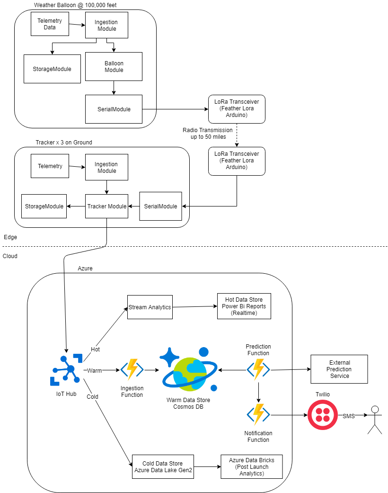

# High Altitude Weather Balloon

The goal is to track a weather balloon at altitude up to 100,000 feet in real-time and while in flight use the cloud to predict where the balloon will land.  The balloon is an edge device that aggregates data and determines the current balloon state.  Information necessary to track and make landing predictions will be sent via Long Range (LoRa) radio to ground based tracker devices.  These tracker devices will then send the messages to the Azure cloud where it will be used to predict where the balloon will land.  Each member of the chase team will receive the prediction and balloon location via SMS.  PowerBi will display real-time IoT telemetry.  Azure Data Lake will be used to store all data and allow post launch analysis with Azure Data Bricks.

04/30/2019 Status - The code is almost complete. The Edge devices and LoRa have been running reliably.  Need to tweak LoRa settings.  There are some minor things to do in the cloud code.  We just ordered the weather balloon and preparing for a launch around the end of May.

Technology:
- [Azure IoT Edge](https://docs.microsoft.com/en-us/azure/iot-edge/how-to-install-iot-edge-linux-arm)
- Microsoft Azure - Azure Functions, CosmosDB, IoT Hub
- Python, C# .NET Core 2.1, 3.0, C++
- Raspberry Pi, Arduino - Big fans of [AdaFruit](https://www.adafruit.com/product/3078)
- Docker
- [Radiohead](https://www.airspayce.com/mikem/arduino/RadioHead/) (LoRa Library)
- PowerBi
- Automated testing - XUnit, FakeItEasy, [Coverage Gutters](https://marketplace.visualstudio.com/items?itemName=ryanluker.vscode-coverage-gutters)
- Azure DevOps
- [Twilio](https://docs.microsoft.com/en-us/azure/azure-functions/functions-bindings-twilio)

# Architecture

